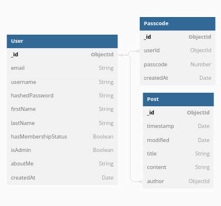

# The Ironic Cave Clubhouse
The Ironic Cave Clubhouse is a web application where registered users can write anonymous posts. Inside the clubhouse, members can see who the author of a post is, but non-members can only see the contents by unknown users. This project uses Node.js, Express, MongoDB, Mongoose, EJS, and Tailwind CSS.

## Data Model Schema


## Features

- User local authentication and authorization with Passport.js
- Allow registered users to get a membership with a secret passcode using email
- Admin users can delete messages
- Anonymous posts visible to non-members
- Members can see the author and date of each post

## How to setup

1. Clone the repository: 
```
git clone https://github.com/yourusername/members-only.git
```

2. Change into the project directory: 
```
cd members-only
```

3. Install the dependencies: 
```
npm install
```

4. Create a `.env` file in the root of the project and add the following environment variables:
```.env
PORT=3000
MONGODB_URI=<your_mongodb_connection_string>

SECRET_KEY=<secret key for express-session library>
SENDGRID_API_KEY=<your sendgrid api key for email services>
```

5. Start the development server: 
```
npm run devstart
```

6. Open your browser and navigate to `http://localhost:3000`.